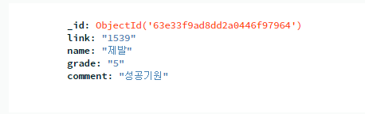

`회고`
오늘부터는 진행하고있는 팀프로젝트에 집중하기로 하였다.
우리 팀은 개발자 세미나 정보를 크롤링해와서 데이터에 넣고, 그 데이터를 표시해주고 상세보기에서 세미나에 대한 후기를 남길 수 있는 프로젝트를 진행하기로 하였다.

원래 프로젝트 기획은 로그인과 회원가입, 그리고 메인(리스트), 상세페이지였고
내가 맡은 부분은 로그인 파트였다.

처음에는 웹개발종합반에서 들었던것을 응용하여 데이터를 등록하고 그 데이터 입력조건이 맞으면 회원가입, 아니면 회원가입 실패
그리고 등록된 회원조건과 아이디, 비밀번호가 일치하면 로그인 그렇지않으면 로그인 실패

이렇게 단순하게 생각하였으나, 로그인 후 메인페이지, 상세페이지에 계속 로그인 정보가 떠 있어야 하고
그리고 상세페이지에서 댓글을 등록할때 해당 유저의 닉네임을 가지고오기때문에
당연한얘기지만 `로그인 세션`을 계속 유지를 해야했다.

목요일까지 완료해야하는 토이프로젝트에서 이부분은 시간이 부족하여 다른 기능에 집중하기 위해 빼버렸다.
아쉽지만 다음기회에는 꼭 로그인/회원가입을 만들어보고싶다.

그래서 우리 팀의 기획은 아래 두가지 페이지로, 기능은 다음과 같다.
`메인(리스트)페이지`
크롤링 해온 세미나 정보를 표시하며, 상세보기 버튼 클릭시 해당 세미나의 상세 페이지로 이동

`상세 페이지`
리스트에서 클릭한 세미나의 상세 정보를 보여주며, 닉네임과 별점, 코멘트를 등록할 수 있고 등록한 코멘트를 표시한다

이 두가지 페이지에서 내가 맡은부분은 코멘트 등록 부분이다.

`코멘트 등록 기능 구현`
본래 기획자였다 보니 개발을 진행하기 전에 각 페이지들마다 구조와 방법을 고민하게 되는 습관이 있는데,
상세페이지의 경우 html파일은 하나지만 각 페이지들마다의 html파일을 만드는것이 아닌 각 리스트의 index 값을 파라미터로 받아 상세페이지를 생성하는 방향으로 진행해야할것 같다고 이야기를 하였다.

그렇게 해야 코멘트를 등록했을때 해당 게시글의 index값과 함께 저장되어야 DB에 저장된 코멘트를 불러올때 해당 페이지의 index와 맞는 코멘트만 불러와서 보여줄수 있기 때문이다.

먼저 app.py에서 링크값(link), 닉네임(name), 별점(grade), 댓글(comment)를 프론트에서 받아올 수 있도록 준비하였다
받아온 값들은 각각 link, name, grade, comment에 저장될것이다.

`app.py`

```ruby
@app.route("/detail", methods=["POST"])
def comment_post():

    link_receive = request.form['link_give']
    name_receive = request.form['name_give']
    grade_receive = request.form['grade_give']
    comment_receive = request.form['comment_give']

    doc = {
        'link':link_receive,
        'name':name_receive,
        'grade':grade_receive,
        'comment':comment_receive
    }
    db.comments.insert_one(doc)

    return jsonify({'msg': '댓글 등록 완료'})
```

그리고 상세 페이지 html에서 link를 제외한 각각 값을 받는 input과 select를 만들어서 값을 받았다.
link는 app.py에서 프론트로 넘길 필요 없이 바로 값을 받아오고 싶었으나, flask에서 mongoDB를 호출하는 방법을 잘 몰라서 이 방법을 찾기위해 많은 구글링을 하였으나, 찾을수가 없었다.

그래서 방향을 다르게 정하여 `어차피 내 페이지 url의 파라미터값을 index로 link에 값을 넣는거라면, 내가 접속한 페이지의 url에서 가져와서 저장해도 되겠다`고 생각하였고, 이는 프론트에서도 처리해줄수 있을것 같아 찾아보았다.

구글링하여 찾아보았더니, 스크립트로 현재 페이지의 url정보를 받아오는 방법이 있어 그 방법을 응용해보기로 하였다.

`detail.html`

```ruby
<script>
        var url_num =document.location.href.split("/")[4];

        function check_comment(){

            let link = url_num;
            let name = $('#name').val()
            let star = $('#star').val()
            let comment = $('#comment').val()

        $.ajax({
            type: 'POST',
            url: '/detail',
            data: { link_give:link, name_give:name, grade_give:star, comment_give:comment},
            success: function (response) {
                alert(response['msg'])
                window.location.reload()
                }
            });
        }
</script>
```

url_num에 현재 페이지의 url을 /를 기준으로 문자열을 나누고 4번째 index에 있는 값을 저장하였다(파라미터값)
그리고 link에는 값을 입력받지 않고 이 값을 받아 넘겨주었다.


이를 구현하기 위해서 본래 리스트의 index 값이 있어야 하는데, 크롤링 해오는 세미나 정보중에 세미나의 상세페이지 url을 가져오는것을 확인하였다.
`seminar/1234`와 같은 식으로 링크 정보를 저장하고 있었는데, 이를 온전히 활용하기 위해서는 seminar 뒤에 있는 `1234`만 저장하도록 코드를 수정하고 해당 값을 `link`에 저장하도록 코드를 수정하였다.

```ruby
   url = seminar.select_one('header > strong > a')['href']
   #url/seminar/1234

    link = url.split('/')[2]
   #[0]url / [1]seminar/ [2]1234
```

soup으로 select_one하여 url값을 가져오고, 받아온 url값을 url에 넣어 link에는 url에서 /를 기준으로 문자를 잘라서 2번 index에 있는 int값만 가져오는 방향으로 수정하였다.

이렇게 잘라온 link를
